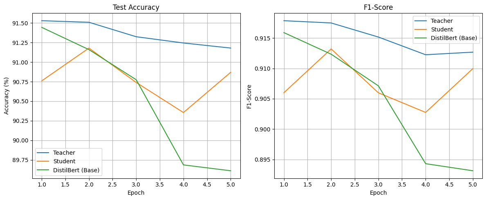
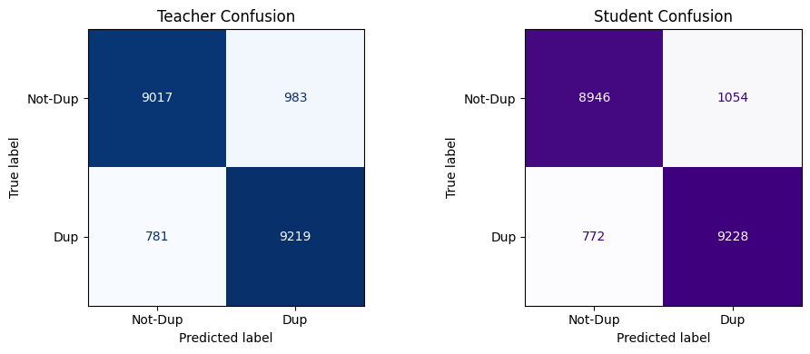

# BERT-to-DistilBERT Knowledge Distillation for Question Classification

  

 

## Description

This project applies **knowledge distillation** to compress a large BERT model into a smaller, faster DistilBERT student for binary classification of questions in the Quora Insincere Questions dataset. We trained a BERT-based teacher model and distilled its knowledge into a DistilBERT student using both ground-truth labels and softened teacher outputs. We compared this distilled student to a baseline DistilBERT trained without distillation.

## Dataset

This project uses the Quora Insincere Questions Classification dataset from a Kaggle competition. The dataset contains over 1.3 million labeled questions, each marked as either sincere (label 0) or insincere (label 1). Insincere questions are defined as those that are based on false premises, inflammatory, or intended more as statements than genuine inquiries. The data is highly imbalanced, with insincere questions comprising only about 6% of the training set. This makes the task particularly challenging and a strong test case for evaluating the effectiveness of knowledge distillation in binary text classification. You can find the dataset [here](https://www.kaggle.com/competitions/quora-insincere-questions-classification).

## Key Results
- **Teacher (BERT):** Highest performance (F1: 0.913)
- **Student (Distilled DistilBERT):** Competitive performance (F1: 0.910), 40% smaller and significantly faster
- **Baseline DistilBERT:** Lower F1 and accuracy compared to the distilled student

  

 
